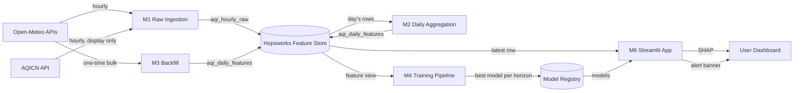

# Pearls AQI Predictor — Implementation Plan

**Target city:** Islamabad, Pakistan (parameterized in code — adding a second city later is a config change, not a redesign)
**Feature Store / Model Registry:** Hopsworks (free tier)
**Dashboard hosting:** Streamlit Community Cloud
**Data sources:** see "Data source design decision" below — this refines the brief's "AQICN or OpenWeather" choice into a concrete, backfill-safe combination.

---

## 0. Context

This is the NUST/Shine "Pearls AQI Predictor" assignment: an end-to-end, 100%-serverless ML system that forecasts AQI for the next 3 days. The brief explicitly leaves several technology choices open (feature store, data API, dashboard framework) — those were resolved with you before writing this plan:

| Decision | Choice | Why |
|---|---|---|
| Feature store / model registry | **Hopsworks** | Free tier, purpose-built for exactly this hourly-ingest / daily-train pattern, first-class Python SDK, plugs cleanly into GitHub Actions via one secret. |
| Target city | **Islamabad, Pakistan** | Sensible default for a NUST project; city is a config value, not hardcoded. |
| Dashboard host | **Streamlit Community Cloud** | Free, deploys straight from GitHub, keeps the whole stack serverless. |
| Data source | **AQICN + Open-Meteo**, refined (see below) | Your answer, with one important refinement to avoid a real pitfall. |

### Data source design decision (important refinement)

AQICN's free API (`api.waqi.info/feed/{city}`) gives current readings and a short forecast, but **no deep historical time series** in the free tier — you'd have no clean way to backfill 6–12 months of training data from it. Open-Meteo's **Air Quality API**, by contrast, exposes `us_aqi` directly (a globally-computed AQI, not just raw pollutants) with a real historical archive (`start_date`/`end_date` going back to mid-2022) at no cost and no key.

So the design uses:
- **Open-Meteo Air Quality API** → the actual training **target** (`us_aqi`) and pollutant features (pm2.5, pm10, CO, NO₂, SO₂, O₃), for both live ingestion *and* historical backfill. Using one consistent source for both avoids a subtle bug where the backfilled target (computed one way) doesn't match the live target (computed another way).
- **Open-Meteo Weather API** → weather features (temperature, humidity, wind, pressure, precipitation), also live + historical from the same provider.
- **AQICN** → kept in the stack as you asked, but in a **display/credibility role**: the dashboard shows "live official station reading right now" alongside the model's forecast, and optionally AQICN's own naive forecast as a baseline to compare against. It is not used as training data, so a future free-tier change on AQICN's side can't break the model.

This is called out explicitly so it isn't a silent deviation from your answer — AQICN is still integrated, just not as the historical training source.

---

## 1. Repository structure

```
aqi-predictor/
├── .github/workflows/
│   ├── feature_pipeline.yml        # hourly: raw ingestion
│   ├── daily_aggregation.yml       # daily: build engineered feature row
│   └── training_pipeline.yml       # daily: retrain + register models
├── src/
│   ├── config.py                   # city registry, AQI thresholds, env var names
│   ├── data_sources/
│   │   ├── openmeteo_client.py      # air quality + weather (live & historical)
│   │   └── aqicn_client.py          # live station reading + naive forecast (display only)
│   ├── features/
│   │   ├── feature_engineering.py   # pure functions: lags, rolling stats, time features, change rate
│   │   ├── raw_ingestion.py         # hourly: fetch -> write to aqi_hourly_raw FG
│   │   └── daily_aggregation.py     # daily: hourly rows -> engineered row -> aqi_daily_features FG
│   ├── hopsworks_utils/
│   │   ├── connection.py            # get_feature_store(), get_model_registry()
│   │   ├── feature_groups.py        # schema definitions, get_or_create helpers
│   │   └── feature_views.py         # aqi_daily_features_view definition
│   ├── training/
│   │   ├── data_prep.py             # feature view -> pandas, shift() to build h1/h2/h3 targets
│   │   ├── models.py                # model factory: ridge, random forest, xgboost, SARIMAX, LSTM
│   │   ├── train.py                 # train + evaluate all candidates per horizon
│   │   └── register.py              # persist best model per horizon to Model Registry
│   ├── inference/
│   │   └── predict.py               # load latest feature row + models -> {h1, h2, h3} forecast
│   ├── explainability/
│   │   └── shap_utils.py            # SHAP explainer, cached background sample
│   └── alerts/
│       └── aqi_scale.py             # single source of truth: AQI value -> category/color/alert level
├── scripts/                         # thin CLI entrypoints called by GH Actions / cron
│   ├── run_feature_pipeline.py
│   ├── run_daily_aggregation.py
│   ├── backfill_historical.py       # --start-date --end-date --city
│   └── run_training_pipeline.py
├── app/
│   ├── streamlit_app.py             # entrypoint
│   └── pages/
│       ├── 1_Forecast.py
│       ├── 2_Historical_Trends.py
│       └── 3_Model_Explainability.py
├── notebooks/
│   └── 01_eda.ipynb
├── tests/
│   ├── test_feature_engineering.py  # pure functions, no network
│   └── test_aqi_scale.py
├── requirements.txt
├── .env.example
├── README.md
└── REPORT.md                        # final deliverable #4, filled in as work progresses
```

---

## 2. Modules

### M1 — Feature Pipeline (hourly raw ingestion)
**Script:** `scripts/run_feature_pipeline.py` → `src/features/raw_ingestion.py`

For each configured city: call Open-Meteo Air Quality API + Weather API for the current hour, call AQICN for the live display reading, assemble one row, insert into the `aqi_hourly_raw` feature group.

### M2 — Daily Aggregation (feature engineering)
**Script:** `scripts/run_daily_aggregation.py` → `src/features/daily_aggregation.py`

Runs once/day (00:10 UTC, after the day's hourly rows are complete). Reads that UTC day's rows from `aqi_hourly_raw`, aggregates to one row, computes time-based features (day of week, month, weekend flag) and derived features (lags, rolling mean/std, `aqi_change_rate`), inserts into `aqi_daily_features`.

### M3 — Historical Backfill
**Script:** `scripts/backfill_historical.py --start-date --end-date --city`

Calls Open-Meteo's historical archive endpoints directly (not the hourly loop) for the full date range in one batch call per city, runs the same aggregation/feature-engineering functions from M2 on the returned data, and bulk-inserts into `aqi_daily_features`. Target: backfill from Open-Meteo's earliest available date (~mid-2022) to today, giving 2–3 years of daily training rows.

### M4 — Training Pipeline
**Script:** `scripts/run_training_pipeline.py` → `src/training/*`

1. `data_prep.py`: pull `aqi_daily_features` via the Feature View, sort by date per city, build `target_h1 = aqi_mean.shift(-1)`, `target_h2 = shift(-2)`, `target_h3 = shift(-3)`; drop the trailing rows where targets are still unknown.
2. `train.py`: for each horizon (h1/h2/h3), train and evaluate: Ridge, Random Forest, XGBoost, SARIMAX (statistical baseline), and an LSTM (sequence of past 14 days → next 3 days, multi-output) — satisfying the "statistical to deep learning" guideline. Score with RMSE/MAE/R² on a time-based holdout (last ~60 days, never shuffled — this is a time series).
3. `register.py`: register the best model per horizon in the Hopsworks Model Registry as `aqi_forecast_h1` / `_h2` / `_h3`, with metrics, feature list, and training-window metadata attached.

### M5 — CI/CD Automation
GitHub Actions, three workflows (contracts below): hourly raw ingestion, daily aggregation, daily training. Each installs `requirements.txt` and passes secrets as env vars.

### M6 — Web App / Dashboard
**Entrypoint:** `app/streamlit_app.py`, hosted on Streamlit Community Cloud.

- Loads the 3 registered models + the latest feature row for the city (read-only Hopsworks access).
- Shows: today's live reading (AQICN, display-only) + 3-day forecast cards with AQI category/color, a historical trend chart, SHAP feature-importance panel, and a hazardous-AQI alert banner.

### M7 — Explainability
**Module:** `src/explainability/shap_utils.py`

`shap.TreeExplainer` built once (cached) against a sample of training rows for whichever model type won each horizon; falls back to `KernelExplainer` if the winning model isn't tree-based (e.g., Ridge or LSTM). Rendered as a bar chart in the dashboard's "Model Explainability" page.

### M8 — Alerts
**Module:** `src/alerts/aqi_scale.py` (shared by dashboard and training pipeline)

Standard EPA-style breakpoints (0–50 Good … 301–500 Hazardous). Any horizon ≥151 ("Unhealthy") triggers a visible dashboard banner; ≥201 is flagged as critical. This module is the single source of truth so the dashboard and any future notifier (e.g., a GitHub Actions step that pings a webhook) never disagree on thresholds.

### M9 — EDA & Report
`notebooks/01_eda.ipynb` (trend/seasonality analysis, correlation between pollutants/weather and AQI, missing-data check) and `REPORT.md`, which is the final submission #4 — filled progressively with architecture, EDA findings, model comparison table, and what was/wasn't achieved.

---

## 3. Data schemas

### `aqi_hourly_raw` (Feature Group, primary key: `city`+`ts`, event time: `ts`)

| Column | Type | Source |
|---|---|---|
| city | string | config |
| ts | timestamp (UTC) | ingestion time |
| aqi | double | Open-Meteo `us_aqi` |
| pm2_5, pm10, carbon_monoxide, nitrogen_dioxide, sulphur_dioxide, ozone | double | Open-Meteo air quality |
| temperature_2m, relative_humidity_2m, wind_speed_10m, wind_direction_10m, surface_pressure, precipitation | double | Open-Meteo weather |
| aqicn_live_aqi | double, nullable | AQICN feed (display-only, null on failure) |

### `aqi_daily_features` (Feature Group, primary key: `city`+`date`, event time: `date`) — used for training

| Column | Type | Description |
|---|---|---|
| city, date | string, date | keys |
| aqi_mean, aqi_max, aqi_min | double | daily aggregate of `aqi` |
| pm2_5_mean, pm10_mean, co_mean, no2_mean, so2_mean, o3_mean | double | daily pollutant means |
| temp_mean, humidity_mean, wind_speed_mean, pressure_mean, precipitation_sum | double | daily weather aggregates |
| day_of_week, day_of_month, month, is_weekend | int | time-based features |
| aqi_lag1, aqi_lag2, aqi_lag3, aqi_lag7 | double | previous days' `aqi_mean` |
| aqi_change_rate | double | `(aqi_mean − aqi_lag1) / aqi_lag1` (guarded against div-by-zero) |
| aqi_roll3_mean, aqi_roll7_mean, aqi_roll3_std | double | rolling stats |

Targets (`target_h1/h2/h3`) are **not stored** in the feature group — they're derived at training time via `shift(-1/-2/-3)` on `aqi_mean`, since they require future data that doesn't exist yet for recent rows. This keeps the feature group valid for both training (drop trailing NaNs) and live inference (latest row always usable).

---

## 4. API contracts between modules

### 4.1 External APIs (contract this codebase depends on)

**Open-Meteo Air Quality** — `GET https://air-quality-api.open-meteo.com/v1/air-quality`
Params: `latitude, longitude, hourly=us_aqi,pm2_5,pm10,carbon_monoxide,nitrogen_dioxide,sulphur_dioxide,ozone`, plus either `past_days`/`forecast_days` (live) or `start_date`/`end_date` (backfill). No API key.

**Open-Meteo Weather** — `GET https://archive-api.open-meteo.com/v1/archive` (historical) / `https://api.open-meteo.com/v1/forecast` (live)
Params: `latitude, longitude, hourly=temperature_2m,relative_humidity_2m,wind_speed_10m,wind_direction_10m,surface_pressure,precipitation`. No API key.

**AQICN** — `GET https://api.waqi.info/feed/{city}/?token={AQICN_TOKEN}` → `data.aqi`, `data.forecast.daily`. Requires a free token (email signup).

### 4.2 Internal contracts

**`raw_ingestion.fetch_raw_observation(city_cfg) -> RawObservation`**
A dict/dataclass matching the `aqi_hourly_raw` schema exactly (§3). This is the boundary between "talks to external APIs" and "writes to the feature store" — nothing downstream ever calls an external API directly.

**`feature_engineering.compute_daily_features(hourly_rows: pd.DataFrame) -> pd.DataFrame`**
Pure function, no network/DB calls → easiest thing in the repo to unit test. Input: a day's worth of `aqi_hourly_raw` rows for one city. Output: one row matching `aqi_daily_features` schema (§3). Both M2 (daily job) and M3 (backfill) call this exact function, so live and historical features are computed identically.

**Feature Store → Training contract**
`data_prep.load_training_frame(city) -> pd.DataFrame` reads the `aqi_daily_features_view` (Feature View v1 over `aqi_daily_features`), sorted by date, and returns it with `target_h1/h2/h3` columns appended. This is the only place targets are computed — training code never touches raw APIs.

**Training → Model Registry contract**
Each registered model (`aqi_forecast_h1/h2/h3`) carries required metadata:
```json
{
  "model_type": "random_forest | ridge | xgboost | sarimax | lstm",
  "horizon_days": 1,
  "feature_columns": ["pm2_5_mean", "aqi_lag1", "...", "..."],
  "metrics": {"rmse": 0.0, "mae": 0.0, "r2": 0.0},
  "training_window": {"start": "2022-07-01", "end": "2026-07-24"}
}
```
`feature_columns` is authoritative — the app builds its inference feature vector in exactly this order, so a model trained with a different feature set can never silently be fed the wrong columns.

**Model Registry + Feature Store → Web App contract**
`inference.predict(city) -> {"h1": {"value": .., "date": ..}, "h2": {...}, "h3": {...}}`. Internally: fetch the single most recent row from `aqi_daily_features_view`, select `feature_columns` per model from its metadata, call `.predict()`, zip with today+1/2/3 dates. The app never re-derives features itself — it only ever consumes rows the feature pipeline already computed, so dashboard numbers and training data are guaranteed consistent.

**Alert contract**
`aqi_scale.categorize(aqi_value: float) -> {"category": str, "color": str, "alert_level": "none"|"warning"|"critical"}`. Both the dashboard and any future automated notifier call this — thresholds live in exactly one place.

### 4.3 CI/CD secrets contract

All three GitHub Actions workflows and Streamlit Cloud consume the same secret names, so nothing needs translating between environments:

| Secret | Used by |
|---|---|
| `HOPSWORKS_API_KEY` | all pipelines + app (read-only variant for the app) |
| `AQICN_TOKEN` | hourly ingestion + app (display reading) |
| `HOPSWORKS_PROJECT_NAME` | all pipelines + app |

---

## 5. Workflow (end to end)



**Scheduling (GitHub Actions cron, UTC):**
- `feature_pipeline.yml`: `0 * * * *` — every hour, runs M1.
- `daily_aggregation.yml`: `10 0 * * *` — once/day, runs M2 for the just-completed UTC day.
- `training_pipeline.yml`: `30 0 * * *` — once/day, after aggregation, runs M4.

M3 (backfill) is run manually once (`workflow_dispatch` or local `python scripts/backfill_historical.py`) to seed history, not on a schedule.

---

## 6. Roadmap

| Phase | Deliverable | Depends on |
|---|---|---|
| 0 | Hopsworks project + AQICN token + GitHub repo + secrets configured | — |
| 1 | `data_sources/*`, `raw_ingestion.py`, `aqi_hourly_raw` FG created; manually verified in Hopsworks UI | 0 |
| 2 | `feature_engineering.py` (unit tested), `daily_aggregation.py`, `aqi_daily_features` FG | 1 |
| 3 | `backfill_historical.py` run for ~2–3 years of history | 2 |
| 4 | `notebooks/01_eda.ipynb` — trends, seasonality, correlations | 3 |
| 5 | `training/*` — all candidate models trained/evaluated, best per horizon registered | 3 |
| 6 | 3 GitHub Actions workflows live and running on schedule | 1, 2, 5 |
| 7 | Streamlit dashboard: forecast + trends + SHAP + alerts, deployed to Streamlit Cloud | 5, 6 |
| 8 | `REPORT.md` finalized | all |

---

## 7. Verification plan

- **Unit tests** (`tests/`): `feature_engineering.compute_daily_features` and `alerts.aqi_scale.categorize` against fixed input/output pairs — no network needed, run in CI on every push.
- **M1/M2 manual check**: run locally with `.env` populated, confirm one new row appears in each Hopsworks feature group via the Hopsworks UI.
- **M3 check**: after backfill, row count in `aqi_daily_features` ≈ number of days backfilled; spot-check a few dates against Open-Meteo's website.
- **M4 check**: training script prints an RMSE/MAE/R² comparison table per horizon; confirm 3 models appear in the Hopsworks Model Registry with metadata populated.
- **M5 check**: trigger each workflow manually once via `workflow_dispatch` before relying on cron; confirm green run + new feature-store rows/model version.
- **M6 check**: `streamlit run app/streamlit_app.py` locally, then verify the same behavior after deploying to Streamlit Community Cloud with secrets configured there.
- **End-to-end**: after 3+ days of real hourly/daily runs, confirm the dashboard's 3-day forecast, SHAP panel, and alert banner (force-test by temporarily lowering the threshold) all render correctly against live data.

---

## 8. Open items to confirm before coding starts

1. **Hopsworks account**: do you already have a Hopsworks account/API key, or does that need creating first?
2. **AQICN token**: same question — do you have one, or should Phase 0 include signing up?
3. **Model framework depth**: plan includes SARIMAX + LSTM alongside sklearn/XGBoost to satisfy "statistical to deep learning" — confirm that's the right amount of depth vs. sklearn + one deep model being enough for the timeline you have.
