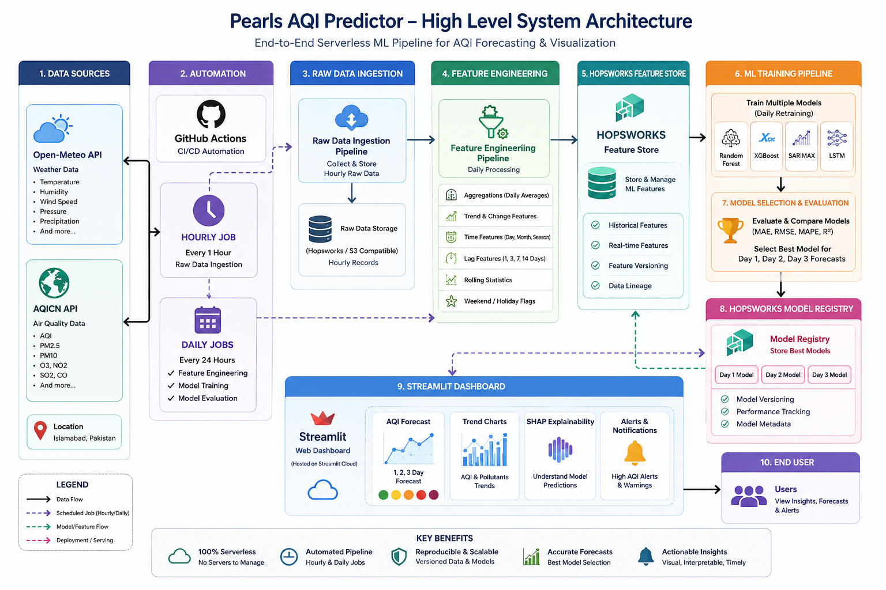

<div align="center">

# 🌫️ Pearls AQI Predictor

### Forecasting Islamabad's Air Quality Index 3 days ahead — on a 100% serverless stack

[](https://www.python.org/)
[](https://www.hopsworks.ai/)
[](https://open-meteo.com/)
[](https://github.com/features/actions)
[](https://streamlit.io/)
[](tests/)
[](LICENSE)

**Air pollution kills an estimated 7 million people a year. This project answers a simple question: _how bad will the air be where I live, three days from now?_**

</div>

---

## 📋 Table of Contents

- [What this is](#-what-this-is)
- [Architecture](#-architecture)
- [Project status](#-project-status)
- [How it works](#-how-it-works)
- [Data & features](#-data--features)
- [Tech stack](#-tech-stack)
- [Getting started](#-getting-started)
- [Running the pipelines](#-running-the-pipelines)
- [Project structure](#-project-structure)
- [Design decisions worth knowing](#-design-decisions-worth-knowing)
- [Troubleshooting](#-troubleshooting)
- [Roadmap](#-roadmap)
- [License](#-license)

---

## 🎯 What this is

An end-to-end machine learning system that collects air-quality and weather data automatically, engineers features from it, retrains forecasting models daily, and serves a 3-day AQI forecast on a live dashboard — **with no servers to manage anywhere in the stack.**

Everything runs on free tiers: GitHub Actions for scheduling, Hopsworks for the feature store and model registry, Streamlit Community Cloud for the dashboard, and Open-Meteo for data.

| | |
|---|---|
| 🏙️ **City** | Islamabad, Pakistan *(city is config-driven — adding more is a 4-line change)* |
| 🔮 **Forecast horizon** | 3 days (separate model per horizon) |
| 📊 **Training data** | 1,454 days · 2022-08-05 → present · 100% complete |
| ⏱️ **Data freshness** | Hourly ingestion, daily retraining |
| 🧪 **Test coverage** | 115 unit tests |

> 📖 **New here?** [Project_Explanation.md](Project_Explanation.md) explains the whole project in plain language — what each module does and why every technology was chosen.
> 🛠️ **Building on this?** [PROJECT_PLAN.md](PROJECT_PLAN.md) has the technical spec — schemas, API contracts, and module boundaries.

---

## 🏗️ Architecture



Data flows left to right:

```
Open-Meteo + AQICN  ─►  Hourly ingestion  ─►  Feature engineering  ─►  Hopsworks Feature Store
                                                                              │
                              ┌───────────────────────────────────────────────┘
                              ▼
                     Daily model training  ─►  Model Registry  ─►  Streamlit dashboard
                     (6 model families,          (best model         (forecast · trends ·
                      best one wins)             per horizon)         SHAP · alerts)
```

Every arrow above is automated. GitHub Actions triggers ingestion hourly and training daily; nothing requires a human once it's running.

---

## 📊 Project status

**✅ All 9 modules implemented.** Pipelines are ready to run on GitHub Actions.

<div align="center">

```
Progress  ████████████████████  100%  (9 / 9 modules)
```

</div>

| # | Module | Status | What landed |
|:--:|---|:--:|---|
| **M1** | Hourly raw ingestion | ✅ **Done** | Fetches live air quality + weather → `aqi_hourly_raw`. Verified end-to-end against live Hopsworks. |
| **M2** | Daily feature engineering | ✅ **Done** | Aggregates + engineers 27 features → `aqi_daily_features`. Verified on 10 days of real data. 26 tests. |
| **M3** | Historical backfill | ✅ **Done** | Loads ~4 years of history (1,454 clean days). 17 tests. ⚠️ *Write pending — see [Troubleshooting](#-troubleshooting).* |
| **M4** | Training pipeline | ✅ **Done** | 6 candidates scored per horizon on 1,469 real days. Best RMSE **8.87** (day 1), **17.47** (day 2), **20.72** (day 3) — all beating the persistence baseline. 67 tests. |
| **M5** | CI/CD automation | ✅ **Done** | Hourly ingestion, daily aggregate-then-train, manual backfill, and a test workflow. |
| **M6** | Streamlit dashboard | ✅ **Done** | Forecast cards, trend chart, SHAP panel, alert banner. Verified end-to-end. |
| **M7** | SHAP explainability | ✅ **Done** | Explainer matched to each winning model family. |
| **M8** | Hazardous AQI alerts | ✅ **Done** | EPA breakpoints in one shared module; warns if any of the 3 days is unhealthy. |
| **M9** | EDA + final report | ✅ **Done** | [EDA.md](EDA.md) generated from the data, plus [REPORT.md](REPORT.md). |

### ✅ What works right now

- Hourly collection of AQI, 6 pollutants, and 6 weather variables
- Full feature engineering: daily aggregates, calendar features, lags (1/2/3/7 days), rolling mean/std, AQI change rate
- Four years of historical data fetching, verified at **1,454/1,454 complete 24-hour days**
- Two Hopsworks feature groups, live and populated
- Multi-model training with per-horizon selection against a persistence baseline
- Explained forecasts (SHAP) and hazardous-air alerts
- 115 unit tests

### 📊 Current model results

Trained on 1,469 real days, scored on a 90-day chronological hold-out:

| Horizon | Winner | RMSE | MAE | R² | vs. baseline |
|:--:|---|--:|--:|--:|--:|
| Day 1 | Ridge | 8.87 | 6.72 | 0.843 | **+29.1%** |
| Day 2 | XGBoost | 17.47 | 14.38 | 0.389 | **+8.5%** |
| Day 3 | Random Forest | 20.72 | 16.98 | 0.141 | **+12.9%** |

Different models win at different horizons, which is exactly why selection happens per horizon rather than once overall. Accuracy degrades sharply with distance — day-3 AQI is genuinely hard, and the persistence baseline actually goes *negative* on R² there (−0.13), meaning "tomorrow equals today" becomes worse than guessing the average.

### 📄 Reports

- **[REPORT.md](REPORT.md)** — full project report: design decisions, results, problems hit, and honest limitations
- **[EDA.md](EDA.md)** — generated data analysis: seasonality, drivers, predictability

### 🚧 Known gaps

- The **LSTM** is implemented but unbenchmarked — TensorFlow wouldn't install on the development network. It runs automatically wherever TensorFlow is present.
- The **Model Registry** write path is implemented but untested end-to-end, for the port-blocking reason in [Troubleshooting](#-troubleshooting). Local model persistence works as a substitute.

---

## ⚙️ How it works

<details>
<summary><b>1 · Hourly ingestion</b> — capture what's happening now</summary>

<br>

Every hour, `run_feature_pipeline.py` asks Open-Meteo for the current AQI, six pollutants (PM2.5, PM10, CO, NO₂, SO₂, O₃) and six weather variables, then writes a single row to the `aqi_hourly_raw` feature group.

Weather matters more than people expect: wind disperses pollution, rain washes it out, and high pressure traps it near the ground — so weather is genuinely predictive, not decoration.

The write is **idempotent** — the primary key is `(city, timestamp)`, so a re-run or CI retry updates the row rather than duplicating it.
</details>

<details>
<summary><b>2 · Daily feature engineering</b> — turn raw numbers into signal</summary>

<br>

Once a day, 24 hourly rows collapse into one information-rich daily row.

The difference this makes:

> **Raw:** "Today's AQI is 97."
> **Engineered:** "Today's AQI is 97, up 19% from yesterday, 3-day average 97 vs 7-day average 87 — so it's trending up. It's a Monday in July, wind was light."

Same underlying data; the second version exposes the patterns a model can actually learn from. Three families of features are built — daily aggregates, calendar features, and trend features. See [Data & features](#-data--features).
</details>

<details>
<summary><b>3 · Historical backfill</b> — don't wait a year for training data</summary>

<br>

A model needs hundreds of examples before it's useful. Collecting those hourly from scratch would take about a year.

Instead, `backfill_historical.py` pulls Open-Meteo's archive back to **2022-08-05** (the earliest date with real air-quality data) and runs it through the *exact same* feature engineering code as the live pipeline — so backfilled and live features can never drift apart.

Result: **1,454 training days spanning four winter smog seasons**, available immediately.
</details>

<details>
<summary><b>4 · Training, serving & the dashboard</b> — planned</summary>

<br>

Daily, the training pipeline will pull features from Hopsworks, train five model families (Ridge, Random Forest, XGBoost, SARIMAX, LSTM), score each on RMSE/MAE/R² against a time-based holdout, and register the winner **per forecast horizon** — day 1, day 2 and day 3 may well be won by different models.

The Streamlit dashboard then loads those models plus the latest features and renders the forecast, trends, SHAP explanations, and hazardous-AQI alerts.
</details>

---

## 📈 Data & features

### Sources

| Source | Role | Auth | Why |
|---|---|:--:|---|
| **Open-Meteo Air Quality** | 🎯 Training target + pollutants | None | Provides `us_aqi` directly, **plus a 4-year historical archive** — the only free source that can do both live and backfill. |
| **Open-Meteo Weather** | 🌤️ Weather features | None | Same provider, so live and historical stay consistent. |
| **AQICN** | 👁️ Display only | Token | Official monitoring-station readings, shown on the dashboard as a real-world reference. **Never used for training** — see [Design decisions](#-design-decisions-worth-knowing). |

### Feature groups

<table>
<tr><th>Feature group</th><th>Grain</th><th>Purpose</th></tr>
<tr><td><code>aqi_hourly_raw</code></td><td>1 row / city / hour</td><td>Raw archive — everything as measured, nothing derived</td></tr>
<tr><td><code>aqi_daily_features</code></td><td>1 row / city / day</td><td>Engineered features — <b>this is what the model trains on</b></td></tr>
</table>

### Engineered features

| Family | Features | Why it helps |
|---|---|---|
| 📊 **Daily aggregates** | `aqi_mean` `aqi_max` `aqi_min` · 6 pollutant means · 4 weather means · `precipitation_sum` | A day averaging 90 but spiking to 160 is a different health situation from a flat 90. Rain is summed, not averaged — daily totals are what matter. |
| 📅 **Calendar** | `day_of_week` `day_of_month` `month` `is_weekend` | Pollution follows human schedules — weekday traffic, winter smog season, monsoon washout. |
| 📈 **Trend** | `aqi_lag1/2/3/7` · `aqi_change_rate` · `aqi_roll3_mean` `aqi_roll7_mean` `aqi_roll3_std` | "97 and rising for 3 days" ≠ "97 and falling". Change rate is *relative*, so +20 points reads correctly at both AQI 30 and AQI 300. |
| 🏷️ **Quality flag** | `hours_observed` | Records how many hours actually contributed, so partially-collected days are visible instead of silently trusted. |

> 🔒 **No data leakage.** Every feature describes information known *as of* that date. Forecast targets are derived at training time by shifting `aqi_mean` — deliberately not stored — so the newest row stays valid for live prediction even though its "tomorrow" doesn't exist yet.

---

## 🛠️ Tech stack

<table>
<tr><td><b>Language</b></td><td>Python 3.10+</td></tr>
<tr><td><b>Data</b></td><td>Open-Meteo (air quality + weather) · AQICN (display)</td></tr>
<tr><td><b>Feature store & registry</b></td><td>Hopsworks</td></tr>
<tr><td><b>Modelling</b></td><td>scikit-learn · XGBoost · statsmodels (SARIMAX) · TensorFlow (LSTM)</td></tr>
<tr><td><b>Explainability</b></td><td>SHAP</td></tr>
<tr><td><b>Automation</b></td><td>GitHub Actions</td></tr>
<tr><td><b>Dashboard</b></td><td>Streamlit · Streamlit Community Cloud</td></tr>
<tr><td><b>Testing</b></td><td>pytest</td></tr>
</table>

*Every tool explained — what it is and why it was picked — in [Project_Explanation.md](Project_Explanation.md#4-the-technology-stack--what-each-tool-is-and-why-we-chose-it).*

---

## 🚀 Getting started

### Prerequisites

| Requirement | Notes |
|---|---|
| Python 3.10+ | 3.11 recommended |
| [Hopsworks account](https://www.hopsworks.ai/) | Free tier. You'll need the **API key** and **project name**. |
| [AQICN token](https://aqicn.org/data-platform/token/) | Free, email signup. |

> ### ⚠️ Windows users, read this first
> `pip install hopsworks` **fails on native Windows.** The dependency chain `hopsworks → pyjks → twofish` includes C code with no prebuilt Windows wheel, so pip tries to compile it and stops with `Microsoft Visual C++ 14.0 or greater is required`.
>
> **Recommended:** run everything in **WSL** — `wsl --install`, then use any Ubuntu distro. It installs cleanly there and matches the Linux environment GitHub Actions uses.
> **Alternative:** install the [Microsoft C++ Build Tools](https://visualstudio.microsoft.com/visual-cpp-build-tools/).

### Installation

```bash
git clone https://github.com/aitazazahsan01/AQI-Predictor.git
cd AQI-Predictor

python3 -m venv .venv
source .venv/bin/activate          # Linux / macOS / WSL

pip install -r requirements.txt
```

### Configuration

```bash
cp .env.example .env
```

Then fill in `.env`:

```ini
AQICN_TOKEN=your_aqicn_token
HOPSWORKS_API_KEY=your_hopsworks_api_key
HOPSWORKS_PROJECT_NAME=your_project_name
```

> 🔐 `.env` is gitignored. **Never commit credentials.** For automation, set the same three names as [repository secrets](../../settings/secrets/actions); for the dashboard, set them as Streamlit Cloud secrets.

### Verify it works

```bash
python -m pytest tests/ -v      # expect 43 passing
```

---

## ▶️ Running the pipelines

```bash
# One-off: seed ~4 years of history (run this first)
python scripts/backfill_historical.py --dry-run     # preview without writing
python scripts/backfill_historical.py               # actually load it

# Recurring
python scripts/run_feature_pipeline.py              # hourly  — collect current conditions
python scripts/run_daily_aggregation.py             # daily   — build engineered features
python scripts/run_training_pipeline.py             # daily   — retrain and register models
```

Or use the wrapper, which handles the venv, `.env` and working directory for you:

```bash
./run.sh test              # unit tests
./run.sh backfill-dry      # preview the historical fetch
./run.sh train-offline     # train on data pulled straight from the API
```

| Script | Cadence | What it does | Useful flags |
|---|:--:|---|---|
| `backfill_historical.py` | once | Loads history from 2022-08-05 into both feature groups | `--start-date` `--end-date` `--dry-run` |
| `run_feature_pipeline.py` | hourly | Writes one raw observation row per city | — |
| `run_daily_aggregation.py` | daily | Builds one engineered feature row per city per day | `--date YYYY-MM-DD` `--all` |
| `run_training_pipeline.py` | daily | Trains all candidates per horizon, registers the winners | `--offline` `--no-register` `--test-days` |

---

## 📁 Project structure

```
AQI-Predictor/
├── .github/workflows/
│   └── backfill.yml               # manual historical backfill job
├── src/
│   ├── config.py                  # city registry — coordinates, station IDs
│   ├── data_sources/
│   │   ├── openmeteo_client.py    # air quality + weather (live & historical)
│   │   └── aqicn_client.py        # station readings, with staleness guard
│   ├── features/
│   │   ├── raw_ingestion.py       # M1 · hourly observation assembly
│   │   ├── feature_engineering.py # M2 · pure feature functions ⭐
│   │   └── historical.py          # M3 · historical fetch + shaping
│   └── hopsworks_utils/
│       ├── connection.py          # Hopsworks login
│       └── feature_groups.py      # feature group definitions
├── scripts/                       # CLI entrypoints (what CI actually runs)
├── tests/                         # 43 unit tests
├── PROJECT_PLAN.md                # technical spec
├── Project_Explanation.md         # plain-language guide
└── requirements.txt
```

⭐ `feature_engineering.py` holds **pure functions** — no network, no database. Both the live daily job and the historical backfill call the same functions, which structurally prevents train/serve skew.

---

## 💡 Design decisions worth knowing

<details>
<summary><b>Why Open-Meteo is the training source and AQICN is display-only</b></summary>

<br>

The brief suggested AQICN or OpenWeather. Neither works well for backfill: AQICN's free tier has **no deep historical endpoint**, so it can't produce training data at all.

Open-Meteo gives `us_aqi` directly *and* a four-year archive, so live ingestion and backfill share one consistent source and methodology.

This turned out to matter. While building, I found AQICN's only Islamabad station (*Islamabad US Embassy*) **hadn't reported since February 2026** — months of silence. Had we trained on it, the pipeline would have been broken from day one. Instead the client treats readings older than 6 hours as unavailable:

```python
if age_seconds > STALE_THRESHOLD_SECONDS:
    return None   # showing nothing beats showing a months-old number
```
</details>

<details>
<summary><b>Why feature engineering lives in pure functions</b></summary>

<br>

**Training/serving skew** is one of the most painful production ML failures: the model learns from features computed one way, then gets fed features computed slightly differently at serving time, and silently degrades in ways that are nearly impossible to trace.

Keeping all feature logic in pure functions means the live daily job and the backfill **literally call the same code**. They cannot diverge. A unit test asserts this contract directly.

The bonus: pure functions need no mocking, network, or credentials to test — which is why this module carries the majority of the test suite.
</details>

<details>
<summary><b>Why the backfill writes to both feature groups</b></summary>

<br>

The original plan had backfill writing only daily features. It writes both, because:

1. **Reproducibility** — if the feature definitions change later (say we add a 14-day lag), features can be recomputed from stored raw data without re-hitting the API.
2. **EDA** — questions like "which hour of day is worst?" need hourly granularity, which daily aggregates destroy permanently.
3. **Boundary correctness** — lag and rolling features work correctly right at the seam between backfilled history and new live data, with no special-casing.

Cost: ~35,000 extra rows. Negligible for a feature store.
</details>

<details>
<summary><b>Two API traps found by probing before writing code</b></summary>

<br>

**1 · Out-of-range dates fail silently.** Requesting data before 2022-08-05 returns a normal-looking **HTTP 200** with the right row count — where every value is `null`. Without a guard, backfilling from 2020 would have loaded ~20,000 rows of pure nulls. Nothing would crash; the data would just quietly be garbage.

> **Lesson: HTTP 200 does not mean the API returned data.**

**2 · "Today" contains forecasts.** Open-Meteo fills the remaining hours of the current day with *forecast* values. Storing those as observations would corrupt the newest row — precisely the row the model leans on most for lag features. The default end date is therefore **yesterday**.
</details>

---

## 🔧 Troubleshooting

<details open>
<summary><b>⚠️ Writes fail: <code>HdfsObjectStore error</code> or <code>Broker transport failure</code></b></summary>

<br>

**Cause:** writing to the Hopsworks *offline* store needs outbound access to HopsFS (`:8020`) and Kafka (`:9092`). Many campus, corporate, and public networks allow only `:443`.

The symptom is confusing because **reads and metadata operations keep working** — you can log in and even create feature groups over HTTPS, but data writes fail.

**Diagnose it** (`portquiz.net` is a generic port-test service, unrelated to Hopsworks):

```bash
python - <<'EOF'
import socket
for host, port in [("portquiz.net", 443), ("portquiz.net", 9092), ("portquiz.net", 8020)]:
    try:
        socket.create_connection((host, port), timeout=8).close()
        print(f"REACHABLE  {host}:{port}")
    except Exception as e:
        print(f"BLOCKED    {host}:{port}  ({type(e).__name__})")
EOF
```

If only `:443` is reachable, it's your network — no code change can fix it.

**Fixes:**
- ✅ Run the pipelines from **GitHub Actions** (runners have unrestricted egress) — this is the permanent fix and where the pipelines are meant to live anyway
- ✅ Switch to a less restricted network (mobile hotspot, home wifi)
- ✅ Use a VPN
</details>

<details>
<summary><b><code>Microsoft Visual C++ 14.0 or greater is required</code> during install</b></summary>

<br>

Native Windows can't build the `twofish` dependency. Use **WSL** (recommended) or install the [C++ Build Tools](https://visualstudio.microsoft.com/visual-cpp-build-tools/). See [Getting started](#-getting-started).
</details>

<details>
<summary><b><code>ModuleNotFoundError: Pyarrow package not found</code></b></summary>

<br>

`requirements.txt` must specify `hopsworks[python]`, not bare `hopsworks` — the `[python]` extra is what pulls in `pyarrow`.
</details>

<details>
<summary><b>Push rejected: <code>without workflow scope</code></b></summary>

<br>

Your GitHub token needs the **`workflow`** scope to create or modify files under `.github/workflows/`. Either add that scope to your personal access token, or add the workflow file through the GitHub web UI.
</details>

<details>
<summary><b>Daily row shows <code>[PARTIAL DAY]</code></b></summary>

<br>

Expected before the backfill runs, or if hourly ingestion missed hours. `hours_observed` records how many hours actually contributed; days below 18 hours are flagged so they can be filtered during training rather than silently trusted.
</details>

---

## 🗺️ Roadmap

- [x] **M1** · Hourly raw data ingestion
- [x] **M2** · Daily feature engineering
- [x] **M3** · Historical backfill (~4 years)
- [x] **M4** · Multi-model training + evaluation
- [x] **M5** · Scheduled CI/CD automation
- [x] **M6** · Streamlit dashboard
- [x] **M7** · SHAP explainability
- [x] **M8** · Hazardous AQI alerts
- [x] **M9** · EDA + final report

---

## 📄 License

Released under the [MIT License](LICENSE).

---

<div align="center">

**Built by [Muhammad Aitazaz Ahsan](https://github.com/aitazazahsan01)**
NUST · Summer 2026

*Air quality data by [Open-Meteo](https://open-meteo.com/) and [AQICN](https://aqicn.org/)*

</div>
